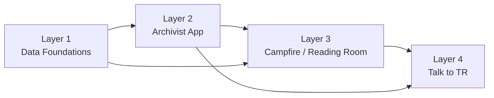

# TRPL

This repository is Microsoft's open-source reference implementation of the
AI-enabled experiences developed for the Theodore Roosevelt Presidential
Library (TRPL). It shows how a museum can connect collection ingestion,
archivist review, retrieval-augmented research, and real-time conversational
experiences in one layered system.

The project is published as a technical showcase so museums, cultural
institutions, researchers, and individual developers can study, reuse, and
adapt the implementation.

## Associated paper

This repository accompanies:

> "The Living Library: Transforming Archival
> Collections into Conversational Knowledge Systems -- Lessons from the
> Theodore Roosevelt Presidential Library."

[Read the paper on arXiv](https://arxiv.org/abs/2609.09368).

## What this repository is

- A working reference architecture composed of four independently useful
  layers.
- Reusable source code, provider-neutral ingestion contracts, synthetic sample
  data, and local Docker workflows.
- A starting point that adopters can customize for their own collections,
  policies, providers, interfaces, and visitor experiences.

The code is provided **as is** under the [MIT License](LICENSE). GitHub issues and pull requests are
reviewed on a best-effort basis, without response or resolution timelines.
Security updates are maintained when issues are confirmed, but no delivery ETA
or service-level agreement is provided.

## Architecture



| Layer | Purpose | Reuse boundary |
| --- | --- | --- |
| [Layer 1 — Data Foundations](Layer1_Data_foundations/README.md) | Provider-neutral collection ingestion, asset processing, OCR, and metadata extraction | Reusable ingestion contracts and synthetic adapter; Azure-backed processing can be replaced or extended |
| [Layer 2 — Archivist App](Layer2_Archivist_App/README.md) | Human review and validation of ingested and AI-generated archival records | Reusable full-stack review workflow; adopters supply their identity, storage, queue, and publication policies |
| [Layer 3 — Campfire](Layer3_Campfire/README.md) | Visitor-facing Reading Room and cited RAG research experience | Reusable web and orchestration patterns; adopters supply their corpus, models, search provider, safety controls, and branding |
| [Layer 4 — Talk to TR](Layer4_Talk_to_TR/LOCAL_DEVELOPMENT.md) | Real-time speech, LiveKit, camera events, and conversational experiences | Reference and experimental real-time integration; avatars, model services, hardware, content, and deployment controls are adopter-owned |

The repository-root [`compose.yaml`](compose.yaml) integrates the four layers
against synthetic data and local emulators. Each layer can also be developed
or adapted independently.

## Reuse and provider portability

Azure services are used by the original implementation and remain the
documented cloud path. They are dependencies of that deployment, not a
restriction on reuse. A fork can replace storage, queues, search, language
models, speech, or other providers while preserving the surrounding contracts
and product behavior.

Provider substitution is already explicit in the Layer 1 content-source
adapter. Other integrations may require implementation work because this
repository preserves the architecture used by the TRPL project rather than
shipping abstractions for every provider.

Tracked fixtures are synthetic. Adopters are responsible for the rights,
privacy, security, accessibility, Responsible AI, retention, and operational
review of their own content and deployment.

## Local quick start

### Prerequisites

- Docker Desktop with Docker Compose
- Python 3.12+
- enough local resources for the selected profile

Configure the shared local environment from the repository root:

```bash
python3 Layer1_Data_foundations/scripts/local_dev.py doctor
python3 Layer1_Data_foundations/scripts/local_dev.py configure
```

Then start the layer you want to explore:

```bash
# Layer 1: synthetic ingestion with Azurite and Cosmos DB emulators
docker compose --env-file Layer1_Data_foundations/.env.local \
  up --build -d functions

# Layers 1 and 2: add the Archivist application and Service Bus emulator
# Review the emulator license terms and set ACCEPT_EULA=Y first.
docker compose --env-file Layer1_Data_foundations/.env.local \
  --profile full-stack up --build -d

# Layer 3: Campfire in explicit provider-unavailable mode
LOCAL_UID="$(id -u)" LOCAL_GID="$(id -g)" \
  docker compose -f Layer3_Campfire/compose.configure.yaml run --rm configure
docker compose --env-file Layer1_Data_foundations/.env.local \
  --profile layer3 up --build -d

# Layer 4: authenticated deterministic brain and visitor/admin server
docker compose --env-file Layer1_Data_foundations/.env.local \
  --profile layer4 up --build -d
```

Local verification commands:

```bash
# Provider-neutral Layer 1 contract and synthetic content pack
python3 scripts/verify_offline_content_flow.py

# Layer 2
python3 Layer2_Archivist_App/scripts/verify_local_queue_flow.py

# Layer 3
docker compose --env-file Layer1_Data_foundations/.env.local \
  --profile layer3 exec -T layer3-backend \
  python /app/scripts/verify_local_stack.py

# Layer 4
python3 Layer4_Talk_to_TR/scripts/verify_local_stack.py
```

Some Layer 1 AI stages require adopter-provided model credentials. Layer 3 and
Layer 4 default local profiles report cloud-backed features as unavailable
rather than generating simulated AI responses. See each layer's documentation
for cloud-backed and hardware-backed acceptance workflows.

## Compatibility and maintenance

This repository is a long-lived showcase of the TRPL implementation. No feature
development is planned. Security maintenance will preserve the documented
interfaces, local workflows, and current behavior.

The repository does not use a semantic-version compatibility guarantee and
does not promise release or maintenance timelines. Forks that replace providers
or substantially customize the reference application own compatibility for
their changes.

## Support and contributions

- Use [GitHub issues](https://github.com/YOUR_ORG/YOUR_REPOSITORY/issues)
  for reproducible defects.
- Pull requests are limited to security maintenance and documentation
  corrections that preserve the published behavior.
- Reviews, fixes, and security updates do not have an ETA or SLA.
- Do not report suspected vulnerabilities in public issues. Follow [SECURITY.md](SECURITY.md). A dedicated public security-reporting
  channel will be published separately before release.

See [CONTRIBUTING.md](CONTRIBUTING.md) and
[CODE_OF_CONDUCT.md](CODE_OF_CONDUCT.md) before participating.

## Project status

Cloud-backed
AI, speech, camera, and real-time media paths require adopter-supplied services,
content, hardware, and policy configuration. The repository will continue to
receive security maintenance on a best-effort basis.
